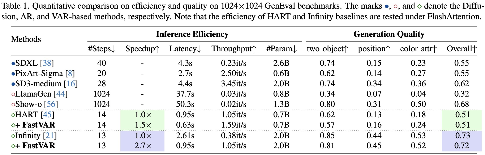

<p align="center">
    
</p>

<div align="center">

<h3>
FastVAR: Linear Visual Autoregressive Modeling via Cached Token Pruning
</h3>

**2K resolution image generation with on single 3090 GPU** 🏔️


[](https://arxiv.org/pdf/2503.23367)

[Hang Guo](https://csguoh.github.io/), [Yawei Li](https://yaweili.bitbucket.io/), [Taolin Zhang](https://github.com/taolinzhang),  [Jiangshan Wang](https://scholar.google.com.hk/citations?user=HoKoCv0AAAAJ&hl=zh-CN&oi=ao), [Tao Dai](https://scholar.google.com.hk/citations?user=MqJNdaAAAAAJ&hl=zh-CN&oi=ao), [Shu-Tao Xia](https://scholar.google.com.hk/citations?hl=zh-CN&user=koAXTXgAAAAJ), [Luca Benini](https://ee.ethz.ch/the-department/people-a-z/person-detail.luca-benini.html)


</div>

> **Abstract:**  Visual Autoregressive (VAR) modeling has gained popularity for its shift towards next-scale prediction. However, existing VAR paradigms process the entire token map at each scale step, leading to the complexity and runtime scaling dramatically with image resolution. To address this challenge, we propose FastVAR, a post-training acceleration method for efficient resolution scaling with VARs. Our key finding is that the majority of latency arises from the large-scale step where most tokens have already converged. Leveraging this observation, we develop the cached token pruning strategy that only forwards pivotal tokens for scalespecific modeling while using cached tokens from previous scale steps to restore the pruned slots. This significantly reduces the number of forwarded tokens and improves the efficiency at larger resolutions. Experiments show the proposed FastVAR can further speedup FlashAttentionaccelerated VAR by 2.7× with negligible performance drop of <1%. We further extend FastVAR to zero-shot generation of higher resolution images. In particular, FastVAR can generate one 2K image with 15GB memory footprints in 1.5s on a single NVIDIA 3090 GPU. 


⭐If this work is helpful for you, please help star this repo. Thanks!🤗

1️⃣**Faster VAR Genration without Perceptual Loss** 

<p align="center">
    
</p>
2️⃣**High-resolution Image Genration (even 2K image on single 3090 GPU)**

<p align="center">
    
</p>
3️⃣**Promising Resolution Scalibility (almost linear complexity)**

<p align="center">
    
</p>


## 📑 Contents

- [News](#news)
- [Pipeline](#pipeline)
- [TODO](#todo)
- [Results](#results)
- [Citation](#cite)

## <a name="news"></a> 🆕 News

- **2023-12-12:** arXiv paper available.
- **2023-12-16:** This repo is released.


## <a name="todo"></a> ☑️ TODO

- [x] arXiv version available 
- [ ] Release code
- [ ] Further improvements

## <a name="results"></a> 🥇 Pipeline

Our FastVAR introduces the "cached token pruning" which works on the large-scale steps of the VAR models, which is training-free and generic for various VAR backbones.

<p align="center">
    
</p>


## <a name="results"></a> 🥇 Results

Our FastVAR can achieve **2.7x** speedup with **<1%** performance drop, even on top of [Flash-attention](https://arxiv.org/abs/2205.14135) accelerated setups. 

Detailed results can be found in the paper.

<details>
<summary>Quantitative Results on the GenEval benchmatk(click to expand)</summary>

<p align="center">
  
</p>
</details>


<details>
<summary>Quantitative Results on the MJHQ30K benchmatk (click to expand)</summary>

<p align="center">
  
</p>
</details>


<details>
<summary>Comparison and combination with FlashAttention (click to expand)</summary>

<p align="center">
  
</p>
</details>


## <a name="cite"></a> 🥰 Citation

Please cite us if our work is useful for your research.

```
@article{guo2025fastvar,
  title={FastVAR: Linear Visual Autoregressive Modeling via Cached Token Pruning},
  author={Guo, Hang and Li, Yawei and Zhang, Taolin and Wang, Jiangshan and Dai, Tao and Xia, Shu-Tao and Benini, Luca},
  journal={arXiv preprint arXiv:2503.23367},
  year={2025}
}
```

## License

Since this work based on the pre-trained VAR models, users should follow the license of the corresponding backbone models like [HART(MIT License)](https://github.com/mit-han-lab/hart) and [Infinite(MIT License)](https://github.com/FoundationVision/Infinity?tab=readme-ov-file). 


## Contact

If you have any questions, feel free to approach me at cshguo@gmail.com

